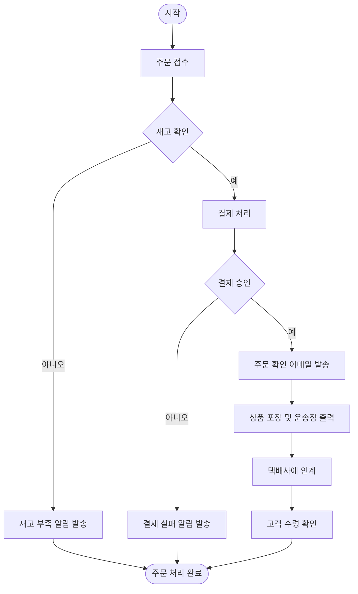

```mermaid
flowchart TD
    A([시작]) --> B[주문 접수]
    B --> C{재고 확인}
    C -->|아니오| D[재고 부족 알림 발송]
    C -->|예| E[결제 처리]
    E --> F{결제 승인}
    F -->|아니오| G[결제 실패 알림 발송]
    F -->|예| H[주문 확인 이메일 발송]
    H --> I[상품 포장 및 운송장 출력]
    I --> J[택배사에 인계]
    J --> K[고객 수령 확인]
    K --> L([주문 처리 완료])
    D --> L
    G --> L
```
